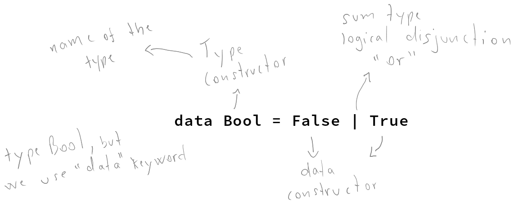

# Basic Datatypes - Chapter 4


<!-- vim-markdown-toc GitLab -->

* [Basic Data Types](#basic-data-types)
* [What are Types?](#what-are-types)
* [Anatomy of a data declaration](#anatomy-of-a-data-declaration)
* [Numeric Types](#numeric-types)
  * [Exercises: Mood Swing](#exercises-mood-swing)
* [Comparing Values](#comparing-values)
  * [Exercises: Find the Mistakes](#exercises-find-the-mistakes)
* [Go On and Bool Me](#go-on-and-bool-me)
* [Chapter Exercises](#chapter-exercises)
  * [01 length](#01-length)
  * [02](#02)
  * [03 length division](#03-length-division)
  * [04](#04)
  * [05](#05)
  * [06](#06)
  * [07 will they work?](#07-will-they-work)
  * [08 palindromoe](#08-palindromoe)
  * [09 abs of a num](#09-abs-of-a-num)
  * [10 tuples](#10-tuples)
  * [Correcting Syntax](#correcting-syntax)
    * [01 fix syntax and uppercase fn name](#01-fix-syntax-and-uppercase-fn-name)
    * [02 uppercase binding name](#02-uppercase-binding-name)
    * [03 A not in scope](#03-a-not-in-scope)
  * [Match the function names to their types](#match-the-function-names-to-their-types)
    * [01 type of `show'](#01-type-of-show)
    * [02 Type of `(==)'](#02-type-of-)
    * [03 Type of `fst'](#03-type-of-fst)
    * [04 type of `(+)'](#04-type-of-)
  * [Question about data constructors vs char](#question-about-data-constructors-vs-char)
* [The End](#the-end)

<!-- vim-markdown-toc -->

## Basic Data Types

Types are also called data types.

* types
* type constructors
* data constructors
* type signatures
* type classes

## What are Types?

Expressions reduce to values when evaluated. Every value has a type. Types are how we group together of sets of values. A certain value has a type, which means that value belong to that type.

## Anatomy of a data declaration

DATA DECLARATIONS are how DATATYPES are defined.

Type signatures live in the **type level** of our code. Values and expressions live at the **term level**.

When you are reading or writing type signatures, the type names or type constructors are what you use.

Data constructors are the values that inhabit the type they are defined in. They are the values that show up in your code at the term level instead of the type level. By term level, we mean they are the values as they appear in your code or the values that your code evaluates to.

```
data Bool = False | True
```

To define a type/datatype, we use the `data` keyword. `Bool` is the type constructor and the name of the type. `False` and `True` are the data constructors for the type `Bool`. `True` and `False` are the values that inhabit (belong to) the `Bool` type.

See datatype definition for built-in types:

```
:info <TypeConstructor>
:info Bool
:info String
:Info Char
:info 1
```

If we query the `:type` of the function `not`, we get back the type constructor (datatype name) it consumes and produces, but when we apply the function then we use data constructors (the values):

```
λ> :type not
not :: Bool -> Bool
λ> :info Bool
data Bool = False | True
λ> not True
False
λ> not False
True
```




## Numeric Types

Integral Numbers:

* `Int`, fixed precision, has upper and lower bounds, cannot be arbitrarily large or small.
* `Integer`, arbitrarily large and small numbers.
* `Word`, whole numbers, integers >= 0.

Fractional numbers:

* `Float` (not fixed-point or fixed-precision), but rather, *floating* point. Floats can shift how many bits it uses before and after the decimal point, causing inconsistencies as `0.1 + 0.2` producing `0.30000000000000004` instead of simply `0.3`. Avoid this type.
* `Double` has twice as many bits as `Float` but has the same problems as `Float`.
* `Rational` is a fractional that represents a ration between two integers. It is as arbitrarily precise but not as efficient as `Scientific`.
* `Fixed` (fixed-point or fixed-precision). `Fixed E2` can have two decimals after the decimal place. `Fixed E9` could hold up to 9 decimal digits after the point. The base library provides `E0`, `E1`, `E2`, `E3`, `E6`, `E9`, and `E12` and you can add your own resolution if necessary.
* `Scientific` are almost arbitrary precision (unlike to hit the limit) represented using scientific notation. Stores the coefficient as an `Integer` and the exponent as an `Int`. It is [available as a library](https://hackage.haskell.org/package/scientific).

All these concrete numeric types have instances of the `Num` typeclass.

* `&&` is the infix operator for boolean conjunction.
* `||` is the infix operator for boolean disjunction.

Haskell does not have “if statements”. It has *if expressions*.

### Exercises: Mood Swing

```
data Mood = Blah | Woot deriving Show
```

1: `Mood` is the name of the type, or the type constructor.

2: `Blah` and `Woot` are the two possible data constructors we can use when something is of the `Mood` type.

3: The type signature should use `Mood`, the type constructor, not `Woot`, which is a data constructor.

```haskell
data Mood = Blah | Woot deriving Show

changeMood :: Mood -> Mood
changeMood Blah = Woot
changeMood Woot = Blah -- <1>

-- 
--     λ> changeMood Woot
--     Blah
--     λ> changeMood Blah
--     Woot
-- 
```

<1> could also be `changeMood _ = Blah` because if the input is not `Blah`, it can only be `Woot`. That is, if we do not fall into the first pattern matching, the second can only the the other possible option.

5: Dutifully done!

If `:info <SomeType>` shows `Unbounded` it means that we can do `minBound :: ThatType`and `maxBound :: ThatType` to figure out their min and max bounds.

```
λ> import GHC.Int
λ> :info Int8
...
instance Bounded Int -- Defined in ‘GHC.Enum’
...
λ> minBound :: Int8
-128
λ> maxBound :: Int8
127
```

The upper bounds of `Word` types is approximately double that of the same size `Int` types because the bit in `Int` values is used to express negative numbers is now used to signify extra positive numbers.

## Comparing Values

Type classes are a way to adding functionality to a type that is reusable across all the types that have instances of that type class.

If `Num` has the `==` function, all concrete numeric types that have instances of `Num` can be compared.

```
λ> :type (==)
(==) :: Eq a => a -> a -> Bool
λ> :type (/=)
(/=) :: Eq a => a -> a -> Bool
```

Both `==` and `/=` take arguments that have instances of the `Eq` type class.

### Exercises: Find the Mistakes

1. `true` is not capitalized. Make it `True`.
2. To compare values, we use `==`, not `=` (the later is used to define things, not to compare things).
3. This one is correct.
4. Probably wanted double quotes around Merry and Happy. Other possibility is that they are data constructors from a typeclass that implements `Eq` and `Ord`.
5. Cannot concatenate two lists with elements of different types. In this case, either compare two lists of numbers, or two lists of strings.

## Go On and Bool Me

We refer to types by their type constructor (names). We only use type constructors in type signatures and not in expressions that make up our *term level* code. Some type constructors take arguments.


## Chapter Exercises

Page 111.

### 01 length

Page 112.

`length` takes one argument: a list of any type. It returns a number (`Int`) which is the number of elements in the list.

```ghci
λ> :type length
length :: Foldable t => t a -> Int

λ> :info length
class Foldable (t :: * -> *) where
  ...
  length :: t a -> Int
  ...
  	-- Defined in ‘Data.Foldable’
```

`Foldable t => t a` means `[[]]`.

### 02

A: 5, because the list contains five numbers.

B: 3, because the list contains three two-tuples.

C: 2, because `allAwesome` contains two lists (which themselves contains other lists, but `length` cares about the topmost elements, and it is two lists).

D: 5, because `concat` _flattens_ the lists, making one single list with the three elements of `awesome` and the other two elements of `also`.

### 03 length division

`6 / 3` is okay, because both 6 and 3 are polymorphic constants. When `/` is applied, then both 6 and 3 are assumed to be of the `Fractional` typeclass, because `/` is defined in the `Fractional` typeclass.

`6 / length [1, 2, 3]` does not work because length returns `Int`, and `/` takes types that have instances of the `Fractional` typeclass, which `Int` simply does not.

### 04

Could use `div` instead because it would work for the polymorphic constant 6 and the return of `length`, which is `Int`.

```ghci
λ> div 6 $ length [1..3]
2
λ> div 6 (length [1..3])
2
```

While 6 is a polymorphic number, it can be "converted” to `Int`, which is the return of `lengt`. But the return of `Int` cannot be converted to a fractional type because `/` only take fractional operands.

### 05

The type of the entire expression is `Bool` and the expected result is `True`, one of `Bool` data constructors.

```ghci
λ> :type 2 + 3 == 5
2 + 3 == 5 :: Bool
λ> 2 + 3 == 5
True
```

### 06

`x` is a `Num`, not a concrete type (remember GHCi does not infer a concrete type until it is forced to, at the last moment). The entire expression type is `Bool`, and the returned value is `False`, one of `Bool` data constructors.

```ghci
λ> x = 5
λ> :type x
x :: Num p => p
λ> :type x + 3 == 5
x + 3 == 5 :: Bool
λ> x + 3 == 5
False
```

### 07 will they work?

- `length allAwesome == 2` works and produces `True`. The function application has the highest precedence. After the application produces 2, comparing it with the other 2 produces `True`.
- `length [1, 'a', 3, 'b']` fails, producing an error. All elements of a list must be of the same type.
- `length allAwesome + length awesome` works and produces 5. First the two ` length` applications will return 2 and 3 respectively. They have higher precedence than `(+)`, which will add those two `Int` values together to produce 5.
- `(8 == 8) && ('b' < 'a'` works and produces `False`. 8 is equal to 8, so it is true. 'b’ is not less than (comes before than) 'a’, so it is false. Then `True && False` is evaluated, which produces `False`, the final result.
- `(8 == 8) && 9` fails, producing an error. The value 9 is not one of the possible values of the type `Bool`, required by `&&`.

### 08 palindromoe

```haskell
isPalindrome :: (Eq a) => [a] -> Bool
isPalindrome s = s == reverse s
-- λ> isPalindrome "racecar"
-- True
-- λ> isPalindrome "ana"
-- True
-- λ> isPalindrome "banana"
-- False
```

### 09 abs of a num

```haskell
myAbs :: Integer -> Integer
myAbs n = if n < 0 then -n else n
-- λ> myAbs (-5)
-- 5
-- λ> myAbs 5
-- 5
```

### 10 tuples

```haskell
f :: (a, b) -> (c, d) -> ((b, d), (a, c))
f (a, b) (c, d) = ((b, d), (a, c))
-- λ> f ("Lara", "Tomb") ("Croft", "Raider")
-- (("Tomb","Raider"),("Lara","Croft"))
```

### Correcting Syntax

Page 114.

#### 01 fix syntax and uppercase fn name

The name of the function has to start with a lowercase.

`x` was defined to be `(+)`, and now `x` is a prefix function. To use it in infix position, surround it with back ticks, not single quotes.

Working solution:

```haskell
f xs = w `x` 1
  where w = length xs
```

#### 02 uppercase binding name

Can’t use uppercase as first letter of identifiers for variables (and functions, for that matter). Correct:

```ghci
\x -> x
```

#### 03 A not in scope

Need a comma between a and b in the tuple param. Also,`A` is interpreted as a data constructor (because it starts with uppercase), but it is not in scope. Fix:

```haskell
f (a, b) = a
```

### Match the function names to their types

#### 01 type of `show'

A: Wrong. Type constructors do not start with lowercase.

B: Wrong. The first `->` should be an `=>`.

C: Correct.

#### 02 Type of `(==)'

A: Wrong. We can’t assume `a`, without any type constraints will have an instance of something that provides `==`.

B: Correct.

C: Wrong. The first `->` should be a `=>`.

D: Wrong. `a` should not be capitalized, and still, missing a second `a`.

#### 03 Type of `fst'

A: Correct.

B: Nonsense.

C: Wrong. It is the type of `snd`, not `fst`.

#### 04 type of `(+)'

A: Wrong. First `->` should be a `=>` and  `(+)` does not return `Bool`.

B: Wrong. Almost fine, except `(+)` does not return `Bool`.

C: Wrong. Typeclasses are capitalized.

D: Correct. Properly return the typeclass-constrained `a`.

D: Wrong. `a` is lacking a typeclass constraint of `Num`.


### Question about data constructors vs char
@TODO @QUESTION
If False is one of Bool's data constructors, what is one data constructor for a character? 'z'? Why can we define something that is capitalized, like Blah and Woot and they are _values_, real data? Looks like data constructors sometimes are themselves data.

gzmorell@haskell-beginners:

All type and data constructors must start with uppercase letter, so 'z', z, or 1 are not valid data constructors. This obviously do not explain how Int or Char are defined inside Haskell. You can see how "magic" is done here https://tech.fpcomplete.com/haskell/tutorial/primitive-haskell

NOTE: That link talks about things I do not yet understand. Read it after I finish the book.

You can define your chars as "data MyChars = La | Lb | Ua | Ub" and then instance show and read to convert to/from String.


## The End
